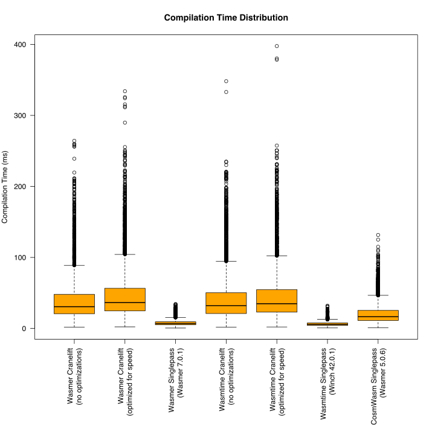

# WASM compilation time

### Tested WASM engines

- Wasmer 7.0.1
- Wasmtime 42.0.1

### Testing platform
 
- Apple M4 Pro, 64 GB

### Test vectors

- 5k+ WASM binaries of smart contracts taken from Neutron blockchain 

### Results




```text
Wasmer Cranelift (no optimizations):
  avg:     40.596 [ms]
  min:      1.855 [ms]
  max:    264.255 [ms]

Wasmer Cranelift (optimized for speed):
  avg:     47.950 [ms]
  min:      2.210 [ms]
  max:    334.020 [ms]

Wasmer Singlepass (Wasmer 7.0.1):
  avg:      7.766 [ms]
  min:      0.572 [ms]
  max:     34.327 [ms]

Wasmtime Cranelift (no optimizations):
  avg:     42.672 [ms]
  min:      1.895 [ms]
  max:    348.166 [ms]

Wasmtime Cranelift (optimized for speed):
  avg:     46.122 [ms]
  min:      2.064 [ms]
  max:    397.614 [ms]

Wasmtime Singlepass (Winch 42.0.1):
  avg:      6.512 [ms]
  min:      0.694 [ms]
  max:     31.798 [ms]

Cosmwasm Singlepass (Wasmer 5.0.1):
  avg:     21.106 [ms]
  min:      0.885 [ms]
  max:    131.617 [ms]
```
